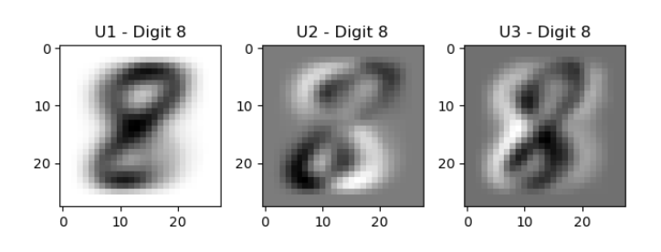
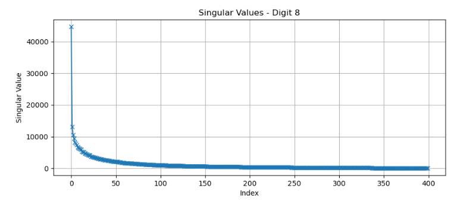
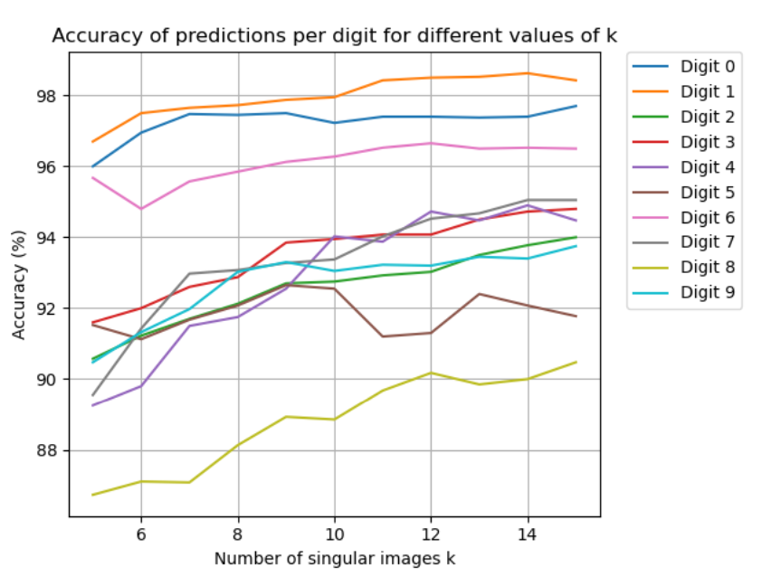

# Handwritten Digit Classification with SVD Pattern Recognition
**Scientific Computing · Numerical Linear Algebra · Python**

 **Full report:** [BerVet_miniproject_2.pdf](report/BerVet_miniproject_2.pdf)

This project classifies handwritten digits (0–9) by building a low-dimensional subspace for each digit using **SVD**, then predicting labels via **projection residuals**. 
The goal is to explore how numerical linear algebra can be applied to pattern recognition by constructing subspaces for each digit and classifying test images based on projection residuals. All computations are performed using efficient NumPy matrix operations.

---

## Overview

### Method (SVD subspaces + residual classification)

Each <b>28×28</b> image is reshaped into a vector in <b>ℝ784</b>.  
For each digit <b>d ∈ {0,…,9}</b>, stack <b>n</b> training vectors as columns in <b>Ad</b>.

<b>Step 1 — SVD per digit</b>  
We compute: <code>A_d = U_d Σ_d V_d^T</code>  
and keep the first <b>k</b> left singular vectors <code>U_{d,k}</code> as a basis.

<b>Step 2 — classify by projection residual</b>  
For a test image <b>x</b>, compute the residual:
<code>r_d(x) = || (I − U_{d,k}U_{d,k}^T) x ||_2</code>

<b>Prediction:</b> choose the digit with the <b>smallest residual</b>.  
Implementation is fully <b>vectorized</b> (batch projections, no per-image loops).

---

## Results

### Singular images (examples)

  

### Singular values (examples)

  

### Accuracy vs number of basis vectors \(k\)

  

Using **400 training images per digit** and **40,000 test images**, the total accuracy increases with \(k\) and saturates around \(k \approx 10\).

| k | Accuracy (%) |
|---|--------------|
| 5 | 91.81 |
| 6 | 92.33 |
| 7 | 93.02 |
| 8 | 93.41 |
| 9 | 93.88 |
| 10 | 94.00 |
| 11 | 94.14 |
| 12 | 94.36 |
| 13 | 94.53 |
| 14 | 94.65 |
| 15 | 94.70 |

Increasing `k` improves accuracy but with diminishing returns beyond ~10 basis vectors.

Digits with consistent shapes (e.g., “1”) achieve very high accuracy.  
Digits with high variation (e.g., “8”) are harder to classify.

---

## Reproducibility

### Requirements
- Python 3.x
- NumPy, Matplotlib

### Run
1. Place the provided `.npy` datasets in the project directory (or update paths).
2. Run the main script / notebook to reproduce figures and accuracy table.

